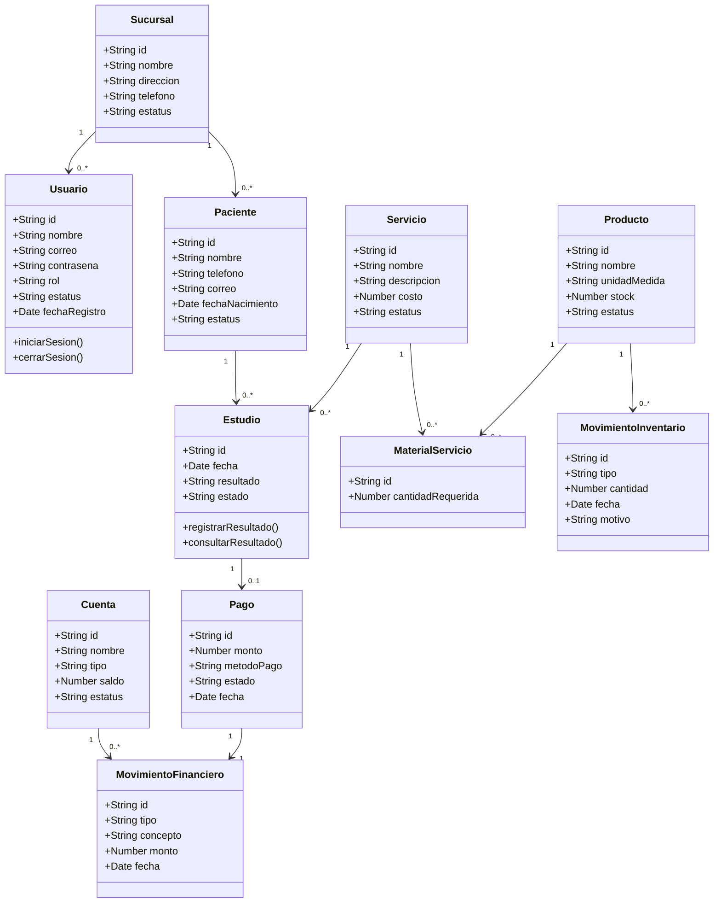

# Diagrama inicial de clases

Este diagrama representa una primera version de las entidades principales del sistema de laboratorios. Puede ajustarse conforme se definan con mas detalle los modulos y reglas de negocio.

## Entidades principales

- `Usuario`: persona que accede al sistema segun su rol.
- `Sucursal`: unidad del laboratorio a la que pertenecen usuarios y operaciones.
- `Paciente`: persona a la que se le realizan estudios.
- `Estudio`: registro de un estudio realizado a un paciente.
- `Servicio`: catalogo de estudios o servicios que ofrece el laboratorio.
- `Producto`: insumo utilizado para realizar servicios.
- `Pago`: registro del cobro de un estudio o servicio.
- `Cuenta`: cuenta interna de efectivo o banco para controlar movimientos.

## Pendientes de definicion

- Campos finales de cada entidad.
- Permisos especificos por rol.
- Manejo de cortes de caja.
- Relacion final entre pagos, cuentas por cobrar y estados de cuenta.
- Integracion con equipos medicos.
