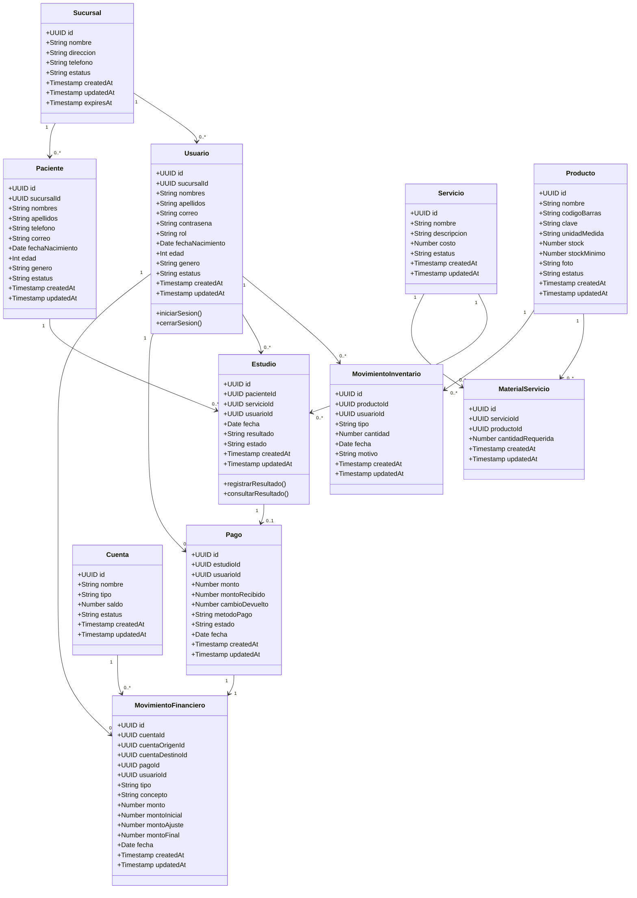

# Diagrama inicial de clases

Este diagrama representa una primera version corregida de las entidades principales del sistema de laboratorios. Se agregan campos de auditoria, identificadores de relacion y ajustes derivados de las observaciones recibidas.

## Entidades principales

- `Usuario`: persona que accede al sistema segun su rol.
- `Sucursal`: unidad del laboratorio a la que pertenecen usuarios y operaciones.
- `Paciente`: persona a la que se le realizan estudios.
- `Estudio`: registro de un estudio realizado a un paciente.
- `Servicio`: catalogo de estudios o servicios que ofrece el laboratorio.
- `Producto`: insumo utilizado para realizar servicios.
- `Pago`: registro del cobro de un estudio o servicio.
- `Cuenta`: cuenta interna de efectivo o banco para controlar movimientos.
- `MovimientoFinanciero`: ingreso, egreso, ajuste o transferencia entre cuentas.

## Correcciones aplicadas

- Se considera `UUID` para los identificadores principales.
- Se agregan campos `createdAt` y `updatedAt` en las entidades principales.
- Se agregan ids de relacion en los modelos que dependen de otras entidades.
- Se separan nombres y apellidos en `Usuario` y `Paciente`.
- Se agregan `fechaNacimiento`, `edad` y `genero` en `Usuario` y `Paciente`.
- Se agregan `codigoBarras`, `clave`, `stockMinimo` y `foto` en `Producto`.
- Se agregan `montoRecibido`, `cambioDevuelto` y `usuarioId` en `Pago`.
- Se ajusta `MovimientoFinanciero` para contemplar cuenta afectada, transferencia entre cuentas, montos iniciales/finales y usuario responsable.

## Pendientes de definicion

- Permisos especificos por rol.
- Manejo de cortes de caja.
- Relacion final entre pagos, cuentas por cobrar y estados de cuenta.
- Integracion con equipos medicos.
- Definir si `edad` se guardara como campo o se calculara a partir de `fechaNacimiento`.
- Definir catalogos finales para `genero`, `rol`, `estatus`, `tipo` y `metodoPago`.
