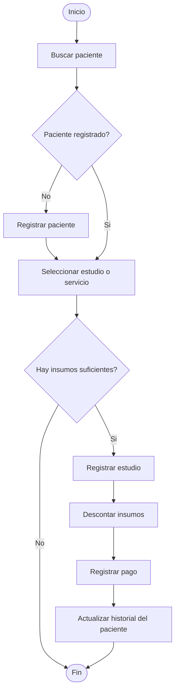

# Flujo de paciente, estudio y cobro

```mermaid
flowchart TD
  inicio([Inicio])
  buscarPaciente[Buscar paciente]
  existePaciente{Paciente registrado?}
  registrarPaciente[Registrar paciente]
  seleccionarServicio[Seleccionar estudio o servicio]
  validarInsumos{Hay insumos suficientes?}
  registrarEstudio[Registrar estudio]
  descontarInventario[Descontar insumos]
  registrarPago[Registrar pago]
  actualizarHistorial[Actualizar historial del paciente]
  finalizar([Fin])

  inicio --> buscarPaciente
  buscarPaciente --> existePaciente
  existePaciente -- No --> registrarPaciente
  registrarPaciente --> seleccionarServicio
  existePaciente -- Si --> seleccionarServicio
  seleccionarServicio --> validarInsumos
  validarInsumos -- No --> finalizar
  validarInsumos -- Si --> registrarEstudio
  registrarEstudio --> descontarInventario
  descontarInventario --> registrarPago
  registrarPago --> actualizarHistorial
  actualizarHistorial --> finalizar
```

