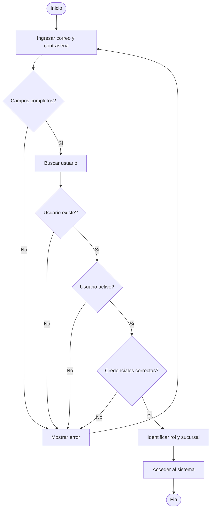

# Proceso de autenticacion

```mermaid
flowchart TD
  inicio([Inicio])
  ingresarCredenciales[Ingresar correo y contrasena]
  validarCampos{Campos completos?}
  buscarUsuario[Buscar usuario]
  usuarioExiste{Usuario existe?}
  usuarioActivo{Usuario activo?}
  validarCredenciales{Credenciales correctas?}
  identificarRol[Identificar rol y sucursal]
  accederSistema[Acceder al sistema]
  mostrarError[Mostrar error]
  finalizar([Fin])

  inicio --> ingresarCredenciales
  ingresarCredenciales --> validarCampos
  validarCampos -- No --> mostrarError
  validarCampos -- Si --> buscarUsuario
  buscarUsuario --> usuarioExiste
  usuarioExiste -- No --> mostrarError
  usuarioExiste -- Si --> usuarioActivo
  usuarioActivo -- No --> mostrarError
  usuarioActivo -- Si --> validarCredenciales
  validarCredenciales -- No --> mostrarError
  validarCredenciales -- Si --> identificarRol
  identificarRol --> accederSistema
  accederSistema --> finalizar
  mostrarError --> ingresarCredenciales
```

