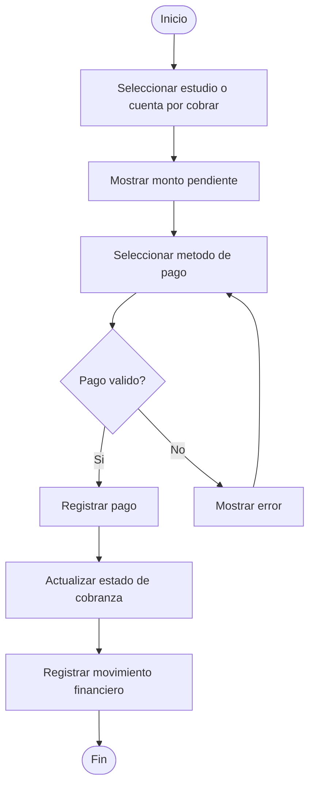

# Proceso de cobro de servicio

```mermaid
flowchart TD
  inicio([Inicio])
  seleccionarCuenta[Seleccionar estudio o cuenta por cobrar]
  mostrarMonto[Mostrar monto pendiente]
  elegirMetodo[Seleccionar metodo de pago]
  validarPago{Pago valido?}
  registrarPago[Registrar pago]
  actualizarEstado[Actualizar estado de cobranza]
  registrarMovimiento[Registrar movimiento financiero]
  mostrarError[Mostrar error]
  finalizar([Fin])

  inicio --> seleccionarCuenta
  seleccionarCuenta --> mostrarMonto
  mostrarMonto --> elegirMetodo
  elegirMetodo --> validarPago
  validarPago -- No --> mostrarError
  validarPago -- Si --> registrarPago
  registrarPago --> actualizarEstado
  actualizarEstado --> registrarMovimiento
  registrarMovimiento --> finalizar
  mostrarError --> elegirMetodo
```

