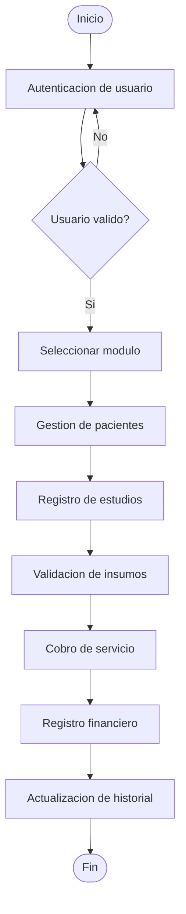

# Proceso general del sistema

```mermaid
flowchart TD
  inicio([Inicio])
  login[Autenticacion de usuario]
  validarUsuario{Usuario valido?}
  seleccionarModulo[Seleccionar modulo]
  pacientes[Gestion de pacientes]
  estudios[Registro de estudios]
  inventario[Validacion de insumos]
  cobro[Cobro de servicio]
  finanzas[Registro financiero]
  historial[Actualizacion de historial]
  finalizar([Fin])

  inicio --> login
  login --> validarUsuario
  validarUsuario -- No --> login
  validarUsuario -- Si --> seleccionarModulo
  seleccionarModulo --> pacientes
  pacientes --> estudios
  estudios --> inventario
  inventario --> cobro
  cobro --> finanzas
  finanzas --> historial
  historial --> finalizar
```

