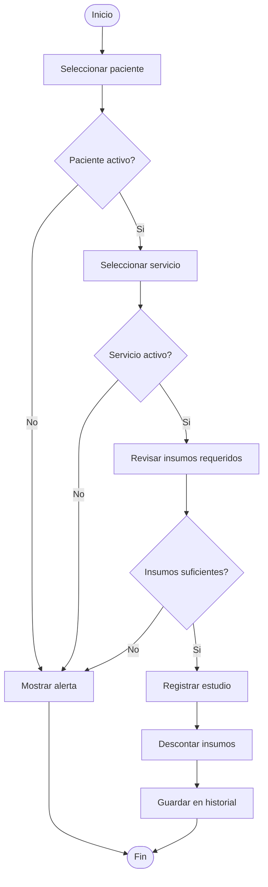

# Proceso de registro de estudio

```mermaid
flowchart TD
  inicio([Inicio])
  seleccionarPaciente[Seleccionar paciente]
  validarPaciente{Paciente activo?}
  seleccionarServicio[Seleccionar servicio]
  validarServicio{Servicio activo?}
  revisarInsumos[Revisar insumos requeridos]
  hayInsumos{Insumos suficientes?}
  registrarEstudio[Registrar estudio]
  descontarInsumos[Descontar insumos]
  guardarHistorial[Guardar en historial]
  mostrarAlerta[Mostrar alerta]
  finalizar([Fin])

  inicio --> seleccionarPaciente
  seleccionarPaciente --> validarPaciente
  validarPaciente -- No --> mostrarAlerta
  validarPaciente -- Si --> seleccionarServicio
  seleccionarServicio --> validarServicio
  validarServicio -- No --> mostrarAlerta
  validarServicio -- Si --> revisarInsumos
  revisarInsumos --> hayInsumos
  hayInsumos -- No --> mostrarAlerta
  hayInsumos -- Si --> registrarEstudio
  registrarEstudio --> descontarInsumos
  descontarInsumos --> guardarHistorial
  guardarHistorial --> finalizar
  mostrarAlerta --> finalizar
```

