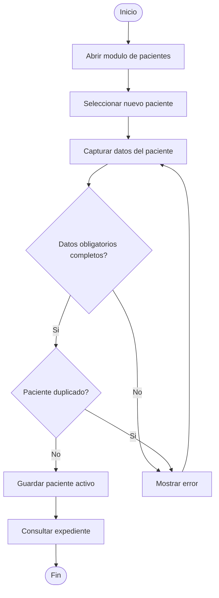

# Proceso de registro de paciente

```mermaid
flowchart TD
  inicio([Inicio])
  abrirModulo[Abrir modulo de pacientes]
  nuevoPaciente[Seleccionar nuevo paciente]
  capturarDatos[Capturar datos del paciente]
  validarDatos{Datos obligatorios completos?}
  verificarDuplicado{Paciente duplicado?}
  guardarPaciente[Guardar paciente activo]
  consultarExpediente[Consultar expediente]
  mostrarError[Mostrar error]
  finalizar([Fin])

  inicio --> abrirModulo
  abrirModulo --> nuevoPaciente
  nuevoPaciente --> capturarDatos
  capturarDatos --> validarDatos
  validarDatos -- No --> mostrarError
  validarDatos -- Si --> verificarDuplicado
  verificarDuplicado -- Si --> mostrarError
  verificarDuplicado -- No --> guardarPaciente
  guardarPaciente --> consultarExpediente
  consultarExpediente --> finalizar
  mostrarError --> capturarDatos
```

